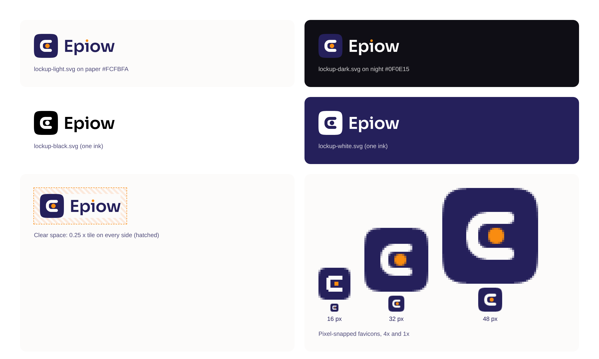

# Epiow logo: master files and usage sheet

This folder is the source of truth for the Epiow mark ("Bracket and signal",
decided 2026-09-23), the "Epiow" wordmark and their lockups. It is the brand
home for Epiow, Epiow Legacy and the Epiow chatbot. Every file in
`current/`, `icons/` and `sheet/` is written by one generator from one
construction, so any file can be rebuilt. Do not edit an output by hand:
change the spec and run the generator.

```bash
node scripts/build-brand.mjs          # needs Node 20+ and Chromium (CHROMIUM=/path to override)
node scripts/build-brand.mjs --check  # SVGs match the spec, every file matches SHA256SUMS (no browser)
```

- Geometry: [`construction/epiow-logo.spec.json`](construction/epiow-logo.spec.json)
- Colours: [`../tokens/brand.tokens.json`](../tokens/brand.tokens.json) (`palette`, `logo.colours`)
- Construction drawing: [`construction/epiow-mark-construction.svg`](construction/epiow-mark-construction.svg)
- Hashes of every output: [`SHA256SUMS`](SHA256SUMS) (`sha256sum -c logo/SHA256SUMS` from the repository root)



## Files

| Need | File |
|---|---|
| Website header, documents, slides (light ground) | `current/lockup-light.svg` |
| Same, on a dark ground | `current/lockup-dark.svg` |
| The mark alone (app tile) | `current/mark.svg` |
| Full-bleed square for OS masks | `current/mark-maskable.svg` |
| The mark without its tile, in dense UI | `current/glyph-on-light.svg`, `current/glyph-on-dark.svg` |
| The word alone | `current/wordmark-light.svg`, `current/wordmark-dark.svg` |
| One ink only (print, engraving, stamps, photos) | `current/{mark,wordmark,lockup}-black.svg`, `-white.svg` |
| Browser tab | `current/favicon.svg`, `icons/favicon.ico` (16, 32, 48), `icons/favicon-{16,32,48}.png` |
| iOS home screen | `icons/apple-touch-icon-180.png` |
| PWA manifest | `icons/icon-{192,512}.png` (purpose `any`), `icons/icon-maskable-{192,512}.png` (purpose `maskable`) |
| Store listing, GitHub avatar | `icons/icon-1024.png`, `icons/icon-512.png` |

`mark.svg`, `favicon.svg`, `lockup-light.svg` and `lockup-dark.svg` are
byte-identical to the files epiow.com served on 2026-09-28
(`/brand/mark.svg`, `/favicon.svg`, `/brand/lockup-light.svg`,
`/brand/lockup-dark.svg`; the site's `/logo.svg` is the same file as
`lockup-light.svg`).

Suggested HTML:

```html
<link rel="icon" href="/favicon.ico" sizes="16x16 32x32 48x48">
<link rel="icon" href="/favicon.svg" type="image/svg+xml">
<link rel="apple-touch-icon" href="/apple-touch-icon-180.png">
<meta name="theme-color" content="#FCFBFA" media="(prefers-color-scheme: light)">
<meta name="theme-color" content="#0F0E15" media="(prefers-color-scheme: dark)">
```

The PWA manifest uses `theme_color` `#25205B` and `background_color` `#FCFBFA`.

## Construction

- **Grid:** 64 units, geometry in 4-unit steps.
- **Tile:** the superellipse |x|^5 + |y|^5 = 1 spanning the whole box, the
  same shape as every Epiow app icon. Indigo `#25205B`.
- **Bracket:** an 8-unit stroke expanded to a filled outline; outer radius 14,
  inner radius 6, round terminals at x = 44. Paper `#FCFBFA`. It is the
  capital E of Epiow and the frame of the organization's workspace.
- **Signal dot:** circle at (36, 32), r = 6, ember `#F98C10`: the person or
  agent doing granted work. It is the only ember in the mark.
- **Wordmark:** "Epiow" in Sora SemiBold 600 (SIL Open Font License 1.1),
  tracked -12/1000 and outlined; the i's tittle is a true circle in ember.
  Letters are indigo on light grounds and paper on dark grounds.
- **Lockup:** wordmark cap height = 0.5 x tile; gap = 0.3 x tile; the
  cap-height band is centred on the tile.
- **One ink:** the tile carries the colour and the bracket and dot are cut
  out of it, so the paper or photo behind shows through. The wordmark and
  its tittle take the same ink.
- No gradients, glows or shadows anywhere in the logo.

## Small sizes

At 16, 32 and 48 px the bracket's straight edges land on whole pixels, but
the signal dot (r = 6 units) lands on whole pixels only at 32 px. At 16 px a
straight scale gives a 3 px dot at half-pixel offsets that smears into the
tile; at 48 px its edge is half a pixel off. So:

- **16 px:** the glyph is drawn on the pixel grid (`small_sizes.16.glyph_pixels`
  in the spec): 2 px arms and stem, a one-pixel chamfer on the two outer
  corners, and a 2 x 2 px dot centred where the vector dot is.
- **32 px:** the vector mark; every edge is already on the grid.
- **48 px:** the vector mark with the dot snapped to r = 4 px.

The tile edge stays anti-aliased at every size. From 180 px up, every file is
the vector mark.

## Clear space and minimum size

- **Clear space:** 0.25 x the tile's height on every side of the mark or the
  lockup (16 px around a 64 px lockup). No text, edge or other logo inside it.
- **Minimum size:** the mark 16 px on screen (use `favicon-16.png` or the
  ICO below 24 px, not the vector); the lockup 24 px tall on screen, 6 mm
  tall in print; the wordmark alone 12 px cap height.
- The SVG viewBoxes are tight to the artwork; add clear space where the logo
  is placed, not inside the file.

## Contrast

| Pair | Ratio |
|---|---|
| Paper bracket on the indigo tile | 14.2:1 |
| Ember dot on the indigo tile | 6.1:1 |
| Indigo letters on paper | 14.2:1 |
| Paper letters on night | 18.6:1 |
| Indigo tile on night | 1.3:1 (the tile merges with a night ground; the bracket carries the mark, as on epiow.com) |

## Do

- Use these files as they are, scaled evenly.
- Use `lockup-light` on paper, white and light photos; `lockup-dark` on night
  and dark photos.
- Use the one-ink versions on busy photos, colour grounds, and anywhere only
  one ink is available.
- Write the name in running text as "Epiow"; use the logo files, not typed
  text, wherever the logo is meant.

## Don't

- Stretch, squash, rotate, skew or outline the logo.
- Recolour the dot or the tittle, add a second ember element, or put the
  colour mark on an ember ground.
- Add gradients, glows, bevels or shadows.
- Close the bracket, add a middle bar, or make the dot a square (the 16 px
  pixel version is the only exception).
- Redraw the tile as a rounded rectangle: it is the superellipse.
- Retype "Epiow" in a font, or change the space between mark and wordmark:
  use a lockup file.
- Write "EPIOW" or "epiow" as the logo.

## Provenance

The mark was drawn by hand as geometry (no trace, no AI raster) for the
2026-09-23 decision, in `EpiowAI/epiow` `apps/web/src/brand/`. On 2026-09-28
this home was rebuilt from the live site and made the source:

| Input | Where it came from |
|---|---|
| Bracket path, dot, lockup ratios, wordmark outlines | `EpiowAI/epiow` main 53fcab769, `apps/web/src/brand/epiow-brand.ts` |
| Tile (superellipse, 160 segments, 2 decimals) | same commit, `apps/web/src/lib/design/app-icon/squircle.ts` |
| Colours, fonts, radius | same commit, `apps/web/src/app/styles/variables.css`, `apps/web/src/app/layout.tsx`; checked against the live CSS bundle |
| Check against production | epiow.com on 2026-09-28: `/favicon.svg`, `/brand/*.svg` byte-identical to the generator's output; the site's PNG icons (rendered by next/og) match these (rendered by Chromium) except in anti-aliased edge pixels (RMSE under 0.7%) |

Renderer: Chromium 153.0.8010.52 headless (`scripts/build-brand.mjs`). Two
runs give identical bytes. Another Chromium version may change edge pixels of
the PNGs; rebuild, look at the result, and commit the new `SHA256SUMS`.

Replaced on 2026-09-28: `current/icon-512.png`, `current/icon-1024.png` and
`current/icon-maskable-512.png` moved to `icons/` (rebuilt); `current/logo.svg`
removed (it was the same file as `lockup-light.svg`). Earlier explorations
stay as archive: `options*/`, `reverse/`, `archive/e-orbit-2026-07/`.

## Trademark

Unregistered. See [`../docs/trademarks.md`](../docs/trademarks.md).
