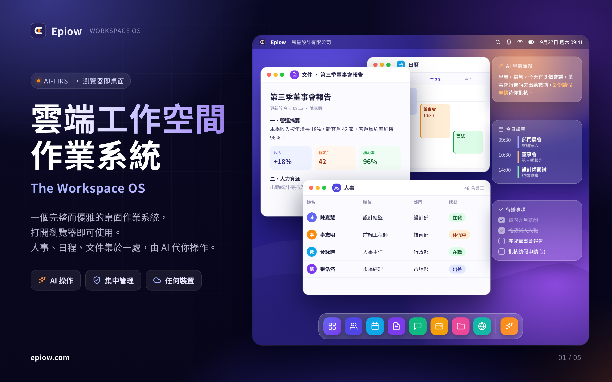
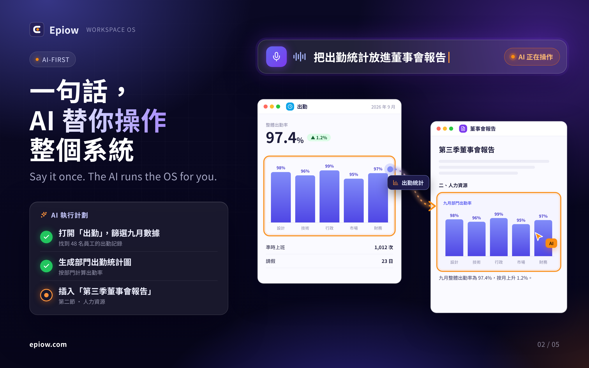
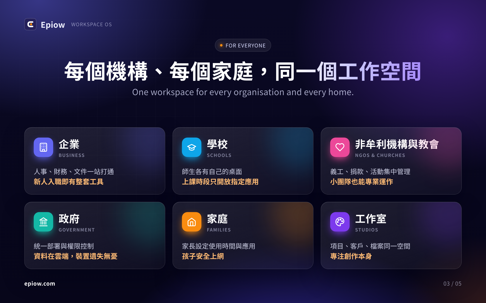
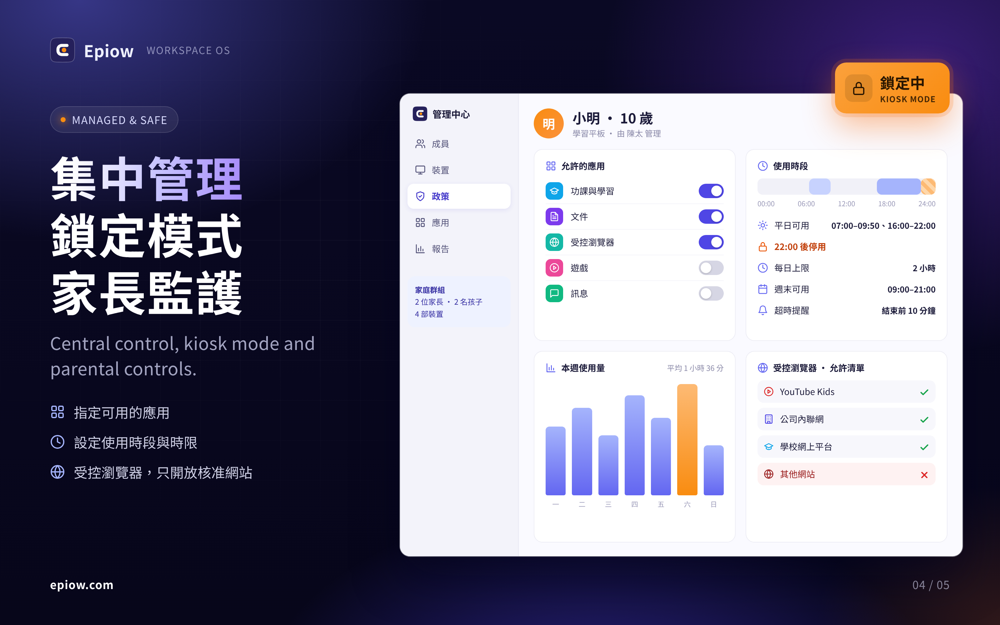
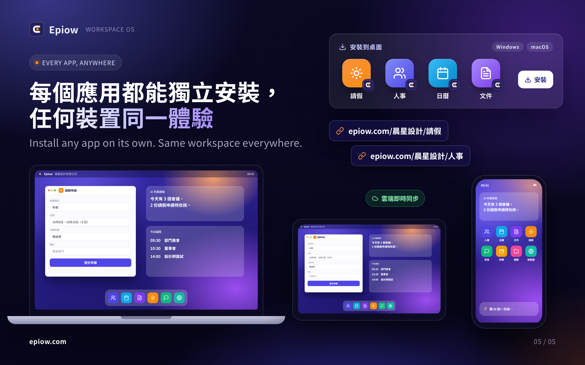

# Epiow vision images (2026-09)

Five share-ready images that introduce Epiow, the Workspace OS, for a partner
briefing. Each is 3200×2000 (1600×1000 at 2x), written in Traditional Chinese
with short English lines, and readable at phone width.

The HTML sources in [`src/`](./src/) are self-contained. To re-render one:

```sh
chromium --headless=new --hide-scrollbars --force-device-scale-factor=2 \
  --window-size=1600,1000 --virtual-time-budget=3000 \
  --screenshot=01-hero.png src/01-hero.html
```

They need the Noto Sans CJK TC font installed locally.

## 1. 雲端工作空間作業系統

The whole desktop in a browser: status bar, dock, People, Calendar and Docs
windows, and widgets for the agenda, tasks and an AI briefing.



## 2. 一句話，AI 替你操作整個系統

One spoken request, a three-step plan, and data moving from Attendance into
the board report.



## 3. 每個機構、每個家庭，同一個工作空間

Businesses, schools, NGOs and churches, government, families and studios.



## 4. 集中管理・鎖定模式・家長監護

The admin panel: allowed apps, time windows, weekly usage, the controlled
browser allowlist, and kiosk mode.



## 5. 每個應用都能獨立安裝，任何裝置同一體驗

Apps installed one by one on Windows or macOS, each with its own link, and the
same workspace on a laptop, a tablet and a phone.


