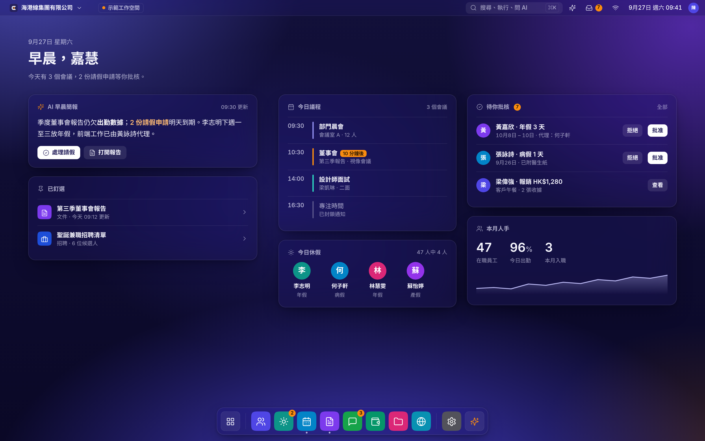
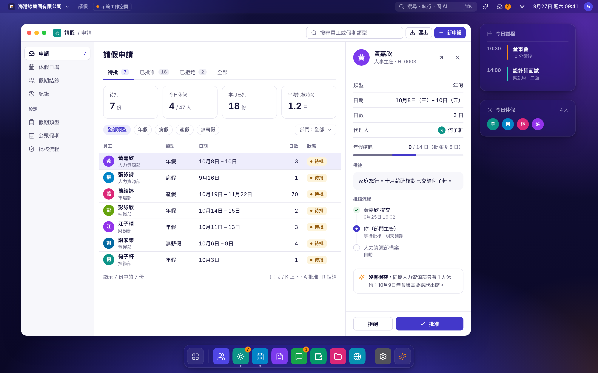
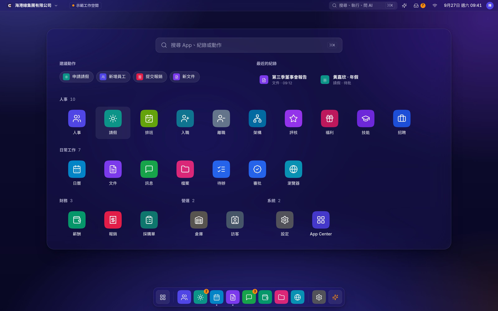
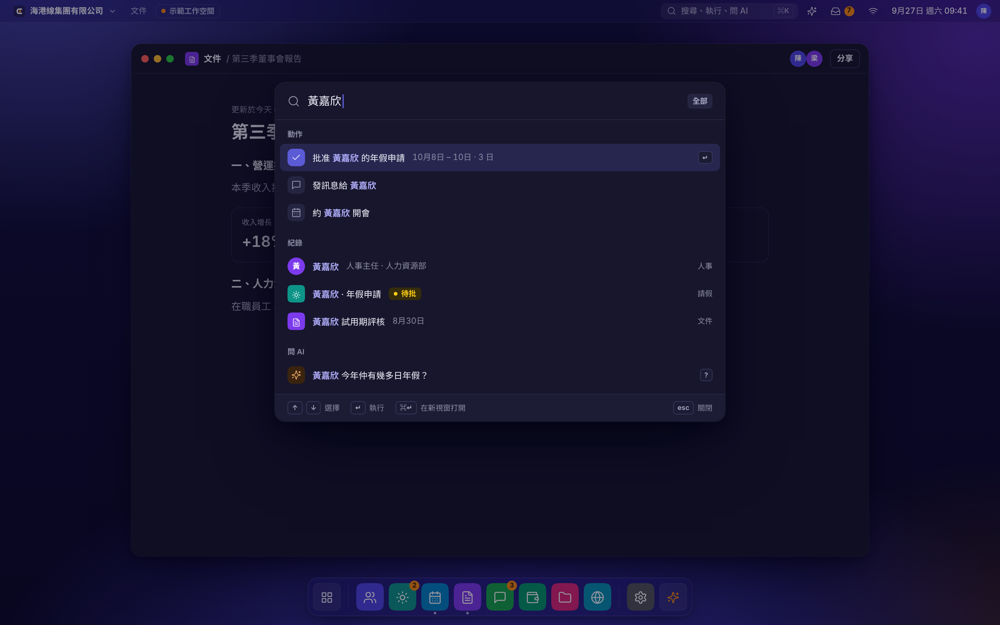
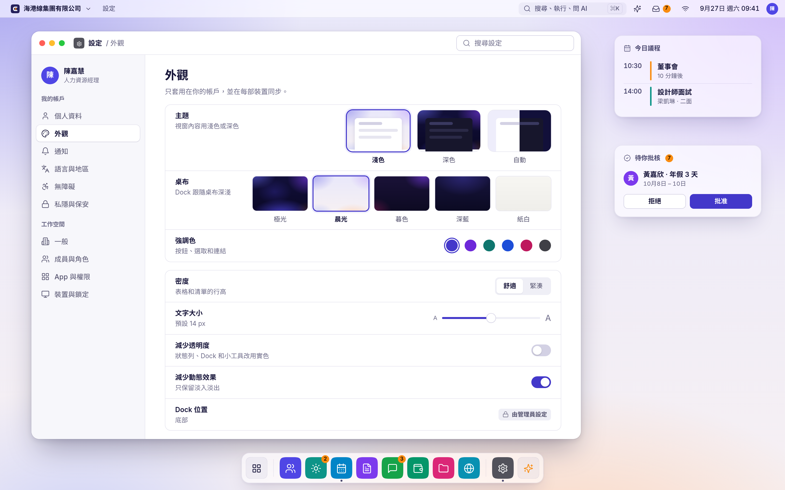
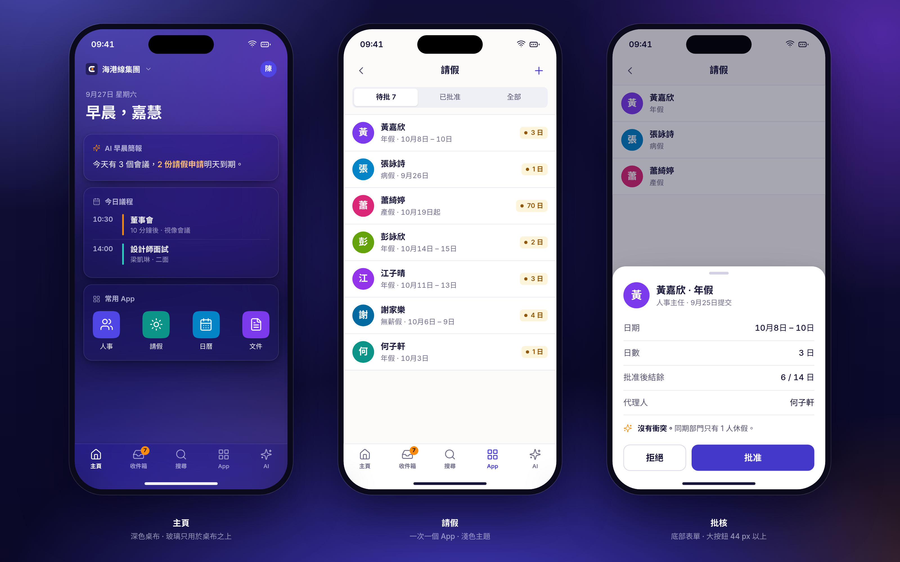
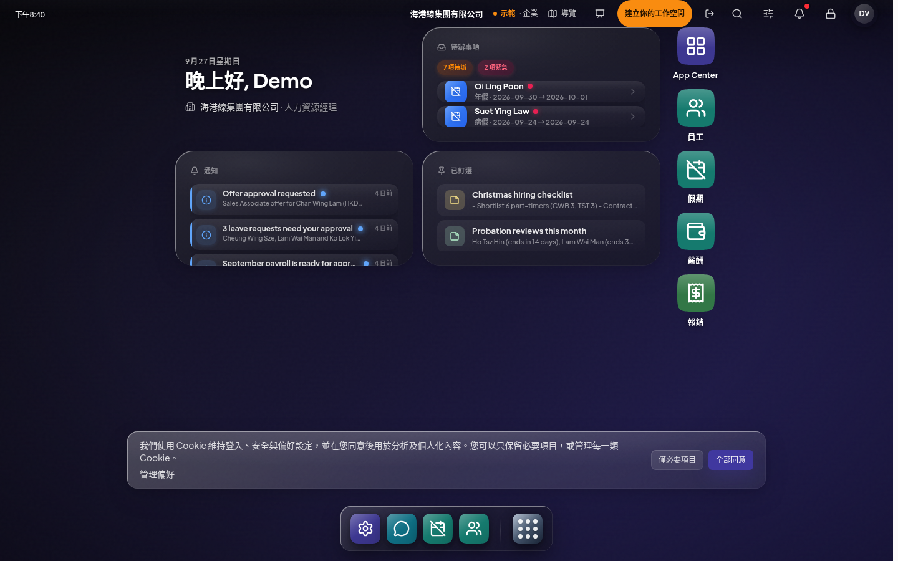
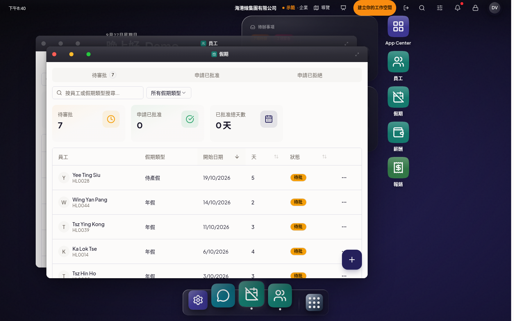
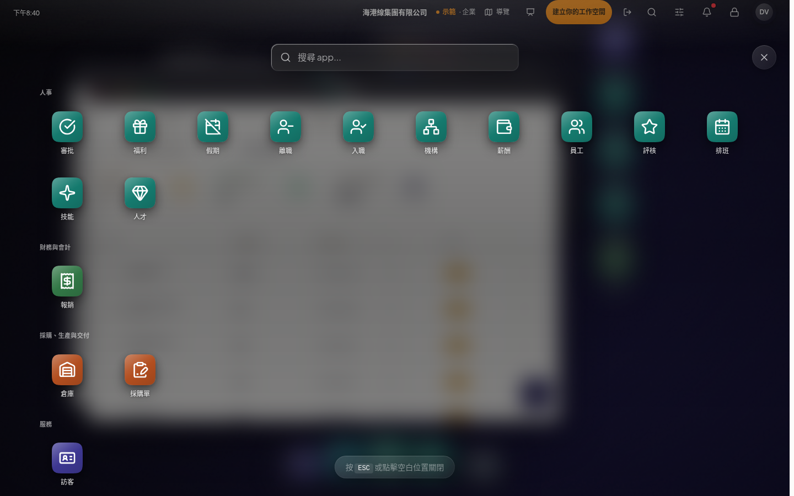
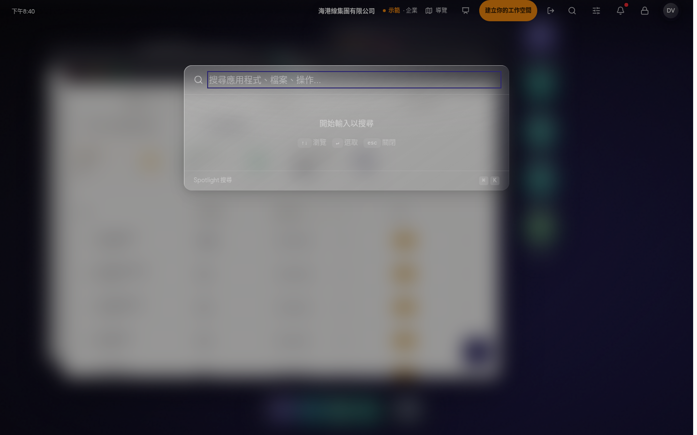

# Epiow Workspace OS visual redesign (proposal, 2026-09-27)

Status: **proposal, waiting for Kyle's approval.** No product code has changed.

Kyle on the current OS: "有啲風格都怪怪哋，即係有啲反光嘅特質，但係睇落去又好似唔係好襯風格"
(the style feels odd; it has a reflective quality that does not suit the look).

This folder holds the diagnosis, the proposed visual language, design tokens v4, and
six mockups built from those tokens. The mockups follow the five
[vision images](../README.md) Kyle approved (brand PR #9): deep indigo aurora, clean windows with soft
shadows, generous whitespace and crisp Chinese type.

**簡介（中文）：** 反光感來自現時殼層仿製的 macOS「Liquid Glass」：每個小工具、Dock、視窗標題列和 App
圖示都加了白色高光、斜向光澤和倒影，而且放在接近黑色的灰色底上，所以看起來像舊式膠面，而不是玻璃。
新方向只保留一種玻璃（只用於桌布之上的狀態列、Dock 和小工具），視窗內容一律用實色；取消所有高光、
光澤、倒影和雜訊；圓角、陰影、字級和圖示各自只有一套；靛藍是唯一主色，琥珀色只用作提示。

## Mockups (1600 × 1000 @2x)

### 1. Desktop with widgets


### 2. App window: Leave, with the record side panel


### 3. Launcher


### 4. Command palette (⌘K), dark theme windows


### 5. Settings > Appearance, light theme on the Dawn wallpaper


### 6. Phone (Focus mode)


## 1. Diagnosis: what is wrong today

Captured from https://epiow.com/demo on 2026-09-27 at 1440 and 390, light and dark
(screens in [`before/`](before/)). Styles were read from the live page's computed styles and
`apps/web/src/app/styles/shell.css` at `EpiowAI/epiow` main.

| Today | Screens |
| --- | --- |
|  |  |
|  |  |

### The reflective look Kyle means

`shell.css` is titled "Liquid Glass (macOS-class)" and adds light effects on top of every
shell surface:

| Effect | Where | Value |
| --- | --- | --- |
| White rim highlight | every widget, the dock, windows | `inset 1px 1px 0 rgba(255,255,255,.42)` plus a `.5px` inner hairline |
| Sheen line along the top edge | every widget | `linear-gradient(90deg, transparent, rgba(255,255,255,.10), transparent)` |
| Diagonal sheen | widget and dock fill | `linear-gradient(145deg, rgba(255,255,255,.22) → .07)` |
| Gloss on app icons | every dock and desktop icon | top-half `rgba(255,255,255,.22)` gradient plus a 145° shine |
| Spotlight on the title bar | every window | `radial-gradient(… at 50% 0%, rgba(255,255,255,.14) …)` |
| Reflection under the dock | dock | a 24px white gradient below the dock, like a glossy floor |
| Glow around active icons | dock | `0 0 22px rgba(255,255,255,.14)` |
| Film grain and vignette | desktop | SVG noise filter and a dark radial vignette |

Liquid Glass depends on a bright, colourful background to refract. Our desktop is almost
black, so the highlights have nothing to bend and read as glossy grey plastic. That is the
"反光" that does not match the brand.

### Other inconsistencies

1. **Grey glass on an indigo brand.** Widgets are `rgba(48,48,58,.62) → rgba(24,24,32,.58)`,
   a neutral grey. Windows in dark mode are `rgba(34,33,41,.78)`. Nothing picks up the indigo.
2. **"Glass" that is not glass.** The desktop widgets have no backdrop blur at all
   (`backdrop-filter: none`); they are flat grey gradients dressed with highlights. Other
   surfaces blur at 18, 32 or 48px with 200% saturation, so the same material looks
   different in each place.
3. **Mixed surfaces with no rule.** Widgets are translucent, windows are opaque cream in
   light mode, the launcher is a dark sheet over a heavy page blur, and ⌘K is a pale grey
   frosted box with grey text on grey (hard to read).
4. **Light theme only changes window contents.** With the theme set to Light, the status
   bar, desktop, dock and widgets stay dark. There is no real light OS.
5. **Radii from different systems.** Live values: widgets 28px, app icons 22.37%, windows
   12px, dock and control centre 16px, cards 14/10/8px. The brand token file says 8/12/16/12,
   and redesign spec §6.1 says 4/6/10/14/20. Three scales, none applied consistently.
6. **Shadows.** 17 different box-shadows on one desktop, mostly pure black at 18–30%, some
   blue (`rgba(96,165,250,…)`) and rose glows on list rows.
7. **Colour misuse.**
   - The largest control on screen is an ember pill ("建立你的工作空間"), while ember is
     meant only for signals.
   - Approval rows use Tailwind blue `#3B82F6` with blue left-edge strips, which is not a brand colour.
   - The HR apps all share one dark teal, so the launcher reads as a wall of identical tiles.
   - The Leave icon is a crossed-out calendar, which reads as "cancelled".
8. **Type has no hierarchy.** 288 of 340 text elements are 16px. Labels drop to 10–11px,
   below the 12px floor. Plus Jakarta Sans for Latin text sits next to Noto CJK for Chinese
   with different widths and weights, so names like "Oi Ling Poon 年假" look mismatched.
9. **Layout noise that looks cheap.** Widget contents are clipped at the bottom edge. Desktop
   icons have their own column with a text shadow. The dock magnifies and moves under the
   cursor. The whole desktop sits on 70% empty black.

Broken layouts (overlaps, clipping, the control centre covering icons) belong to the
layout lane and are not addressed here.

## 2. Direction: calm, premium, legible

Five rules decide most calls:

1. **The wallpaper carries the colour.** A deep indigo aurora (dark) or a soft dawn
   (light). Chrome stays quiet, and content is on solid surfaces.
2. **One glass recipe, only over the wallpaper.** The status bar, dock, desktop widgets
   and launcher use it. Windows, menus over windows, ⌘K and sheets are solid. Glass never
   sits on glass or on a window.
3. **No light effects.** No rim highlights, sheen, gloss, reflections, glows, grain or
   vignettes. Depth comes from a hairline border plus a soft indigo-tinted shadow.
4. **One scale per property.** One radius per layer, one shadow per elevation, one type
   scale, one icon style.
5. **Colour means something.** Indigo is actions and selection. Ember is signals only:
   unread, live, due soon, AI activity, the demo badge, always with dark ink on it.
   Green, amber, red and blue are for status only. App colours appear only on app tiles.

**Theme and wallpaper are separate choices.** The theme sets window contents to light or
dark. The wallpaper sets the chrome tone: dark wallpapers get dark glass, light wallpapers
get light glass. So the vision look (white windows on the aurora) is the default, dark
windows on the aurora is the dark theme, and Dawn plus light windows is a fully light OS.
This is how macOS separates appearance from wallpaper.

## 3. Design tokens v4

Source of truth for these values: [`src/tokens.css`](src/tokens.css). Every mockup is
built from it.

### Colour: content theme

| Role | Light | Dark | Use |
| --- | --- | --- | --- |
| `--bg` | `#FCFBFA` paper | `#0C0B1D` | Page behind content |
| `--surface` | `#FFFFFF` | `#17162C` | Window body, cards, ⌘K, sheets |
| `--surface-2` | `#F7F7FB` | `#1D1C35` | Sidebars, notes |
| `--surface-3` | `#EFEFF6` | `#262541` | Pressed, segmented tracks, neutral chips |
| `--text` | `#17153A` (17.4:1) | `#EEEEF8` (15.3:1) | Body and titles |
| `--text-2` | `#55536F` (7.4:1) | `#AAA9C4` (7.7:1) | Secondary text |
| `--text-3` | `#6F6D8A` (5.0:1) | `#8C8BA6` (5.4:1) | Captions, column headers (still AA) |
| `--border` / `--border-strong` | `#E7E6F0` / `#D3D1E4` | `#2A2946` / `#3A3960` | Hairlines / inputs, dividers |
| `--primary` | `#4338CA` (7.9:1 with white) | `#5B5BD6` (5.4:1 with white) | Buttons, selection, links |
| `--primary-tint` / `--primary-text` | `#EEEDFC` / `#4338CA` | `#27264F` / `#ADABF7` | Selected rows, active chips |
| `--success` / tint | `#12703A` / `#E8F6EC` | `#4ADE80` / `#15321F` | Status only |
| `--warning` / tint | `#92580A` / `#FDF4DC` | `#FACC15` / `#352C0C` | Status only |
| `--danger` / tint | `#C22A3A` / `#FCEBED` | `#F87171` / `#3A1A22` | Status only |
| `--info` / tint | `#1D5FBF` / `#E8F0FC` | `#7DB2FF` / `#16284A` | Status only |
| `--signal` | `#F98C10`, text on it `#291600` (7.3:1) | same | Unread, live, due, AI, demo |
| `--signal-text` / tint | `#A54209` / `#FFF1E0` | `#FDBA74` / `#3A2410` | Ember as text |

Contrast ratios are measured against `--surface` (status colours against their tint);
every pair is at least 4.5:1.

### Colour: chrome (the one glass recipe)

| Token | On dark wallpapers | On light wallpapers |
| --- | --- | --- |
| Fill | `rgba(30,26,80,.40)` indigo tint | `rgba(255,255,255,.62)` |
| Backdrop | `blur(28px) saturate(140%)` | `blur(28px) saturate(160%)` |
| Border | 1px `rgba(255,255,255,.11)` | 1px `rgba(40,34,110,.09)` |
| Shadow | `0 2px 8px rgba(3,2,20,.25), 0 20px 44px -12px rgba(3,2,20,.45)` | `0 2px 6px rgba(30,24,90,.06), 0 18px 40px -12px rgba(30,24,90,.20)` |
| Text / 2 / 3 | `#F4F4FC` / 84% / 74% | `#17153A` / `#4B4970` / `#5A5878` |

Chrome text is measured, not assumed: each step is at least 4.5:1 over the brightest point of every wallpaper of its tone (Aurora and Dawn are the worst cases). The first proposal (72% / 62% dark, `#63617F` light) measured 3.9:1 and 4.4:1 there.
| Inner highlight, sheen, gloss | **none** | **none** |
| Reduce transparency (setting or low-power) | solid `--surface-2` of the matching tone | same |

### Elevation

| Level | Use | Light | Dark |
| --- | --- | --- | --- |
| 0 | Flat content, table rows | none | none |
| 1 | Cards, selected nav item, segmented thumb | `0 1px 2px rgba(20,16,60,.05), 0 1px 1px rgba(20,16,60,.03)` | `0 1px 2px rgba(0,0,0,.30)` |
| 2 | Widgets, dock, popovers, background windows | `0 2px 6px …/.06, 0 12px 28px -8px …/.16` | `0 2px 8px …/.35, 0 16px 32px -8px …/.50` |
| 3 | Focused window | `0 4px 12px rgba(12,10,44,.10), 0 28px 60px -14px rgba(12,10,44,.34)` | `0 6px 16px …/.40, 0 32px 70px -14px …/.70` |
| 4 | ⌘K, dialogs, sheets | `0 8px 24px …/.14, 0 44px 90px -20px …/.46` | `0 10px 28px …/.45, 0 48px 100px -20px …/.80` |

Shadows are tinted with indigo ink, never pure black or coloured glows. Windows also get a
1px edge (`rgba(20,16,60,.07)` light, `rgba(255,255,255,.07)` dark) so they separate
from dark wallpapers.

### Radius (one per layer; an inner radius equals the outer radius minus the padding)

| Token | px | Use |
| --- | --- | --- |
| `--r-xs` | 6 | Status chips, badges, checkboxes, key caps |
| `--r-sm` | 8 | Buttons, inputs, selects, menu items, nav items |
| `--r-md` | 12 | Cards, stat tiles, list groups, menus |
| `--r-lg` | 16 | Windows, widgets, dock, popovers, ⌘K |
| `--r-xl` | 24 | Launcher, bottom sheets, phone cards |
| `--r-full` | 999 | Avatars, filter chips, toggles |
| App tile | superellipse n=5 | Same shape as the logo tile |

### Type

| Step | Size / line height | Weight | Use |
| --- | --- | --- | --- |
| Caption | 12 / 1.5 | 500–600 | Column headers, meta, badges (the floor; nothing smaller) |
| Small | 13 / 1.5 | 500 | Secondary UI, widget headers |
| UI | 14 / 1.5 | 400–600 | Default UI and tables |
| Body | 16 / 1.75 | 400 | Documents, notes, AI text (CJK body 1.75) |
| Title | 20 / 1.4 | 600 | Window page titles |
| H2 | 24 / 1.35 | 600 | Settings pages, stat values |
| H1 | 32 / 1.3 | 600 | Desktop greeting |
| Display | 56 | 600 | Lock-screen clock only (Sora) |

- **Latin and numbers: Inter.** It replaces Plus Jakarta Sans in product UI. Inter's width
  and x-height sit well next to Noto Sans CJK, and it has proper tabular figures (`tnum`).
  Sora stays for the wordmark, the lock-screen clock and marketing display.
- **Chinese, Japanese and Korean: Noto Sans HK / TC / SC / JP / KR** at the same weights,
  loaded per locale.
- CJK rules: no letter-spacing, no italics, headings at 600 (never 800–900 in product),
  `line-break: strict`, full-width punctuation kept. Every changing number uses tabular
  figures.

### Icons

- One set: **Lucide** (already in the product), outline only, 24px grid, round caps and joins.
- Stroke 1.75 at 18–24px and 1.5 at 16px and below. Sizes are 16, 18, 20 and 24.
- No fills, duotone, gradients or emoji in chrome. Icons take the text colour of their
  context; colour comes only from status or the app tile.
- Choose icons for meaning: Leave uses a sun, not a crossed-out calendar.

### App tiles

- Superellipse (n=5, the logo shape), **one flat colour per app**, white Lucide glyph at
  50% of the tile, stroke 1.75.
- No gradient, gloss, inner highlight or text shadow. Tiles get a shadow only in the dock (elevation 1).
- Sizes: 20–28 (lists, title bars), 44 (dock), 56 (launcher), 50 (phone).
- Colour family (each passes 3:1 with the white glyph): indigo `#4F46E5`, blue `#2563EB`,
  sky `#0284C7`, cyan `#0891B2`, teal `#0D9488`, green `#16A34A`, emerald `#059669`,
  lime `#65A30D`, violet `#7C3AED`, purple `#9333EA`, pink `#DB2777`, rose `#E11D48`,
  slate `#475569`, stone `#57534E`.
- **No orange tiles.** Orange belongs to the ember signal.
- System entries (launcher button, AI) use the chrome material with a glyph instead of a colour.

### Wallpapers

Static CSS gradients only: no noise, no grid and no motion by default.

| Name | Tone | Use |
| --- | --- | --- |
| 極光 Aurora | Dark | Default. Indigo and violet with a faint ember corner, as in the vision images |
| 晨光 Dawn | Light | Default for the light theme. Lavender to peach |
| 暮色 Dusk | Dark | Violet and rose |
| 深藍 Deep | Dark | Quiet indigo for kiosks, managed devices and low power |
| 紙白 Paper | Light | Almost flat, for dense work |

The "ember" wallpaper from master plan §4.5 is dropped: a large orange field would dilute
the signal colour. A slow time-of-day version of Aurora and Dawn can follow as the
dynamic option (§5.12), paused under reduced motion and on battery saver.

### Motion

| Token | Value | Use |
| --- | --- | --- |
| `--dur-micro` | 90ms | Hover, press, toggles |
| `--dur-control` | 160ms | Menus, popovers, tabs, window focus |
| `--dur-enter` | 240ms | Window open (opacity plus scale .98 → 1), launcher, ⌘K, sheets |
| `--dur-max` | 400ms | Space switch only |
| `--ease-out` | `cubic-bezier(.22,1,.36,1)` | Everything; no bounce or spring overshoot |

- Removed: dock magnification (it moves the targets you are aiming at), animated blur,
  glow pulses and looping motion.
- Reduced motion: opacity only.

### Density

| | Comfortable (default) | Compact |
| --- | --- | --- |
| Table and list row | 44px | 32px |
| Control height | 36px | 30px |
| Status bar | 36px | 36px |
| Touch layouts | 44px targets minimum | not offered |

Spacing stays on the 4px scale: 4, 8, 12, 16, 20, 24, 32, 40, 48.

## 4. What this changes in existing specs

These are proposals for the design authority, to apply when implementation starts:

| Spec | Today | v4 |
| --- | --- | --- |
| `shell.css` "Liquid Glass" | Specular, sheen, gloss, reflection, 3 blur levels, 200% saturate | Deleted; one glass recipe, blur 28, saturate 140/160% |
| Redesign §6.1 radius | 4 / 6 / 10 / 14 / 20 | 6 / 8 / 12 / 16 / 24 |
| `brand.tokens.json` radius | control 8, card 12, panel 16, window 12 | Windows move to 16, so windows, widgets and the dock share one radius |
| Light `--primary` | Ink `#25205B` | Indigo `#4338CA` for buttons and selection; ink stays for the logo and display headings |
| UI font | Plus Jakarta Sans | Inter (Sora unchanged for brand display) |
| Master plan §4.5 icons | 1.75 stroke, duotone indigo and ember | 1.75 / 1.5 stroke, outline only in product chrome |
| Master plan §4.5 dock | Magnification up to 1.6× | No magnification |
| Master plan §4.5 wallpapers | Dawn, midnight, ember, paper | Aurora, Dawn, Dusk, Deep, Paper |
| Demo "create workspace" button | Ember pill | Indigo primary; ember keeps the demo badge only |

## 5. Rebuild the images

```sh
cd vision/2026-09/os-redesign/src
PLAYWRIGHT=/path/to/node_modules/playwright/index.mjs node render.mjs   # all pages
PLAYWRIGHT=… node render.mjs 02                                         # one page
```

Pages are plain HTML and CSS using `tokens.css`, `os.css`, `os.js` (tiles, dock, status
bar) and `icons.js` (Lucide 0.460 paths). They render at 1600 × 1000 with device scale 2,
the same size and scale as the vision images. Inter and Sora load from Google Fonts;
CJK uses Noto Sans CJK.
